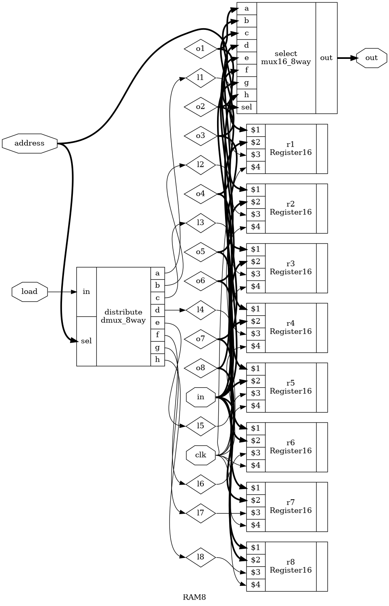
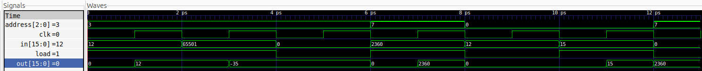

# RAM

As part of learning verilog, and having just followed the beginning of nand2tetris in my
learning journey, I decided to redimplement my 8 x 16-bit register ram module in verilog.

Since it seemed there were no multiplexors or de-multiplexors builtin to verilog,
I built my own!

I also implemented a load based 16-bit register module to use.

[ram.v](ram.v) includes the following modules:

- dmux
- dmux_4way
- dmux_8way
- mux
- mux16
- mux16_4way
- mux16_8way
- Register16
- RAM8

## Interface

```verilog
module RAM8(
	output wire [15:0] out,
	input wire [15:0] in,
	input wire [2:0] address,
	input wire load,
	input wire clk
);
```

## Implementation

My RAM consists of a:

- **Distributer** an 8-way dmux circuit that distributes the load input signal
to the correct register
- **Registers** the 16 bit registers which will connect the 16-bit input signal to their enclosed
output register if the load signal is on
- **Selector** an 8-way 16-bit mux circuit that will 'select' or set the output wire's signal to the
output of the register corresponding to the provided address


<p align="center">
<i>Diagram of my RAM module created by me! using <a href="https://github.com/YosysHQ/yosys">this awesome project</a></i>
</p>



## Testing

For verilog compilation I have been using [verilator](https://github.com/verilator/verilator).

This had an added benefit with their support for C++ testing which I enjoyed quite a bit!

To test the RAM I put together a map of addresses, inputs and loads

```cpp
static const std::vector<std::tuple<uint16_t, uint16_t, unsigned int>> operations = {
// address, input, load
	{3, 	12, 	1},
	{3, 	-35, 	1},
	{3, 	0, 	0},
	{7, 	2360, 	1},
	{0, 	12, 	0},
	{0, 	15, 	1},
	{7, 	0, 	0}
};
```

along with a clock cycle function that toggles the clock bit twice, valuating the module each time, as well as updating
simulation time (dt is the running time)

```cpp
void cycle(const std::unique_ptr<VerilatedVcdC> &trace, const std::unique_ptr<VRAM8> &top)
{
	for (int i = 0; i < 2; ++i)
	{
		top->clk = !top->clk;
		top->eval();
		trace->dump(dt++);
	}
}
```

I was then ready to create waveform data by tracing the module, which I then visualized using [gtkwave](https://github.com/gtkwave/gtkwave).

Here are the results (*I wasn't too worried about time units for this simulation)




